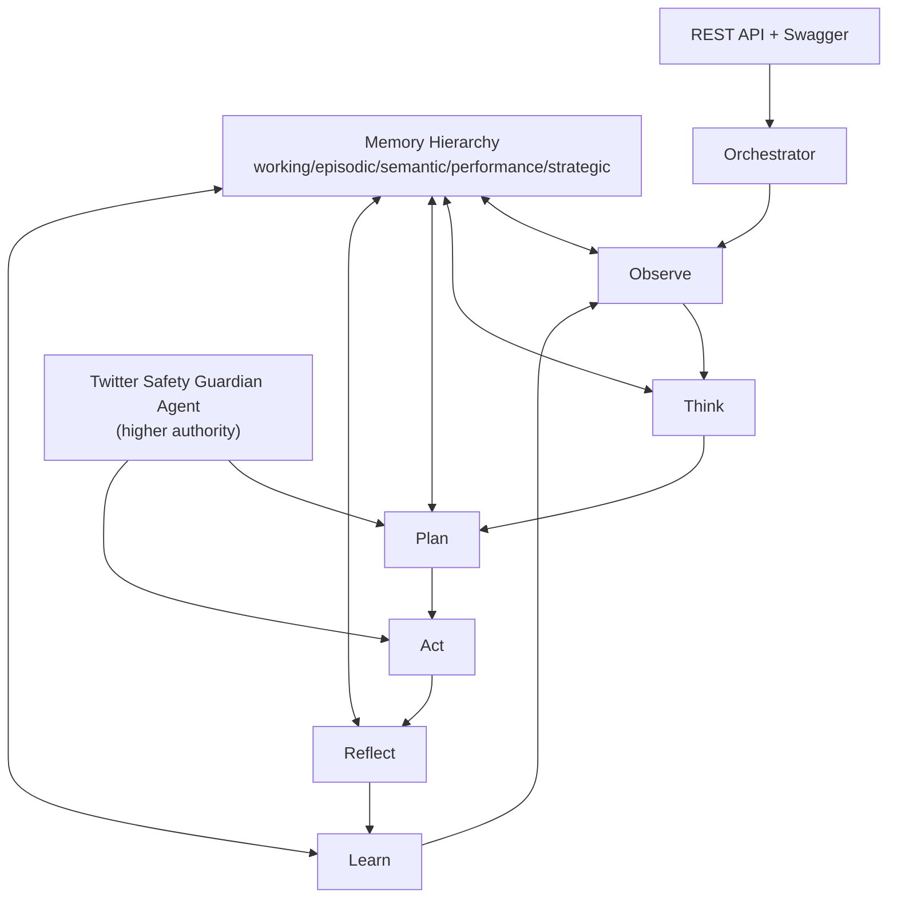

# TWEET-AI: Autonomous Twitter AI Orchestration Platform

Node.js backend scaffold implementing the requested autonomous multi-agent orchestration architecture.

## 1) Architecture Diagram



## 2) Folder Structure

- `src/agents` multi-agent definitions + safety guardian
- `src/core` orchestrator loop
- `src/memory` file-based memory hierarchy
- `src/routes` REST modules
- `src/sheets` Google Sheets schema definitions
- `src/redis` Redis key schema definitions
- `src/middleware` role-based access middleware
- `src/utils` observability logger
- `test` focused safety/orchestration tests

## 3) Database Design

Primary stores:

- Google Sheets as analytics/reporting DB
- Redis (optional) for queue/rate/cache/agent bus
- File-based memory under `data/memory/*.json` as fallback + baseline memory store

## 4) Google Sheet Schemas

Implemented in `src/sheets/schemas.ts`:

1. Trend Intelligence
2. Actions Log
3. Tweets Database
4. Learning Memory
5. Competitor Analysis
6. Weekly Insights
7. Viral Analysis
8. Failure Analysis

## 5) Redis Schemas

Implemented in `src/redis/schemas.ts`:

- Queues: action + retry queues
- Rate limits: daily/hourly/rolling/burst keys
- Cache: trend snapshot + strategy draft
- Agent communication bus channel

## 6) Agent Workflows

Defined in `src/agents/index.ts` and orchestrated via `src/core/Orchestrator.ts`:

- Trend Discovery Agent
- Community Intelligence Agent
- Conversation Understanding Agent
- Memory Agent
- Strategy Agent
- Content Agent
- Human Behavior Agent
- Engagement Agent
- Reflection Agent
- Learning Agent
- Twitter Safety Guardian Agent (hard authority)

## 7) Agent Communication Protocol

- Shared structured context object passed between loop stages
- Shared memory writes into episodic/semantic/strategic stores
- Optional Redis pub/sub bus key namespace defined in schema

## 8) REST API Design

Implemented endpoints:

- `/agents`
- `/memory`
- `/trends`
- `/actions`
- `/tweets`
- `/analytics`
- `/reports`
- `/reflection`
- `/learning`
- `/system-health`
- `/orchestrate`

Swagger:

- `/docs`
- `/openapi.json`

## 9) Scheduler Architecture

`Orchestrator.loop()` provides the autonomous cycle and is scheduler-ready for cron/queue workers.

## 10) Memory Architecture

`MemoryStore` supports:

- Working memory
- Episodic memory
- Semantic memory
- Performance memory
- Strategic memory
- Retrieval + similarity search

## 11) Reflection Architecture

`/reflection` endpoint stores reflection outputs and links them into strategic memory.

## 12) Learning Architecture

`/learning` endpoint stores learned outcomes into semantic memory for future planning.

## 13) Analytics Architecture

`/analytics` and `/reports` expose discoverable insights + schema metadata for dashboarding.

## 14) Full Node.js Implementation Plan

Current implementation is a production-oriented scaffold with clear module boundaries for:

- API layer
- Agent layer
- Safety layer
- Orchestration loop
- Memory and persistence layer
- Observability layer

## 15) Production Deployment Plan

- Containerize app
- Inject secrets via environment variables
- Managed Redis for queue/rate-limits
- Google Sheets service account integration
- Horizontal scaling by stateless API + shared Redis/store

## 16) Scaling Strategy

- Split orchestration workers from API
- Queue-driven action execution
- Cache trend snapshots and strategy drafts
- Shard memory writes by account/workspace

## 17) Cost Optimization Strategy

- Default to small/fast LLMs
- Escalate to larger models only for strategy/reflection
- Aggressive caching and memoized trend/context retrieval

## 18) Monitoring Strategy

`Logger` writes structured event logs (decision/action/failure) for ingestion by external observability systems.

## 19) Safety Strategy

`TwitterSafetyGuardianAgent` enforces strict 20% below thresholds, including:

- Daily limits
- Hourly limits
- Rolling windows
- Burst windows
- Action blocking via delay/queue directive

No other agent can bypass safety because orchestrator checks safety before every cycle.

## 20) Step-by-step Development Roadmap

1. Integrate Twitter/X APIs and auth
2. Integrate Google Sheets persistence adapter
3. Integrate Redis queues and distributed rate-limiters
4. Add true NLP sentiment/intent/trend analysis pipelines
5. Implement adaptive human-behavior session scheduler
6. Add reflection quality scoring and reinforcement updates
7. Add resilience/circuit breakers and retry policies
8. Add full observability dashboards + alerts
9. Run staged rollouts with safety audits
10. Optimize model routing and inference cost policy

## Security and Reliability Notes

- API-key authentication with role-based authorization
- Structured audit/event logging included
- Safety guardian pre-check prevents over-limit actions
- Memory store supports fallback file persistence

## Run

```bash
npm install
cp .env.example .env
npm run build
npm test
npm start
```

`npm start` runs the compiled TypeScript output from `dist/src/index.js`. Use `npm test` to build first and then run the compiled test suite from `dist/test`.

Non-production defaults are available when `AUTH_API_KEYS` is not set:

- `dev-viewer-token`
- `dev-editor-token`
- `dev-admin-token`

Use `Authorization: Bearer <token>` for API requests. Production requires explicit `AUTH_API_KEYS` in `token:role` format.
